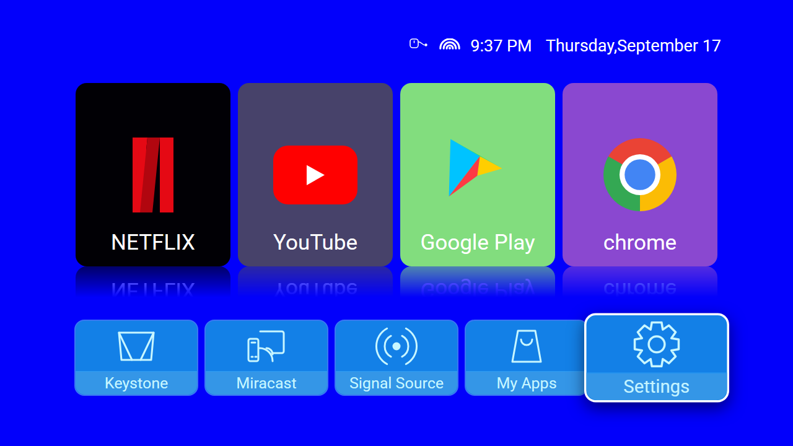
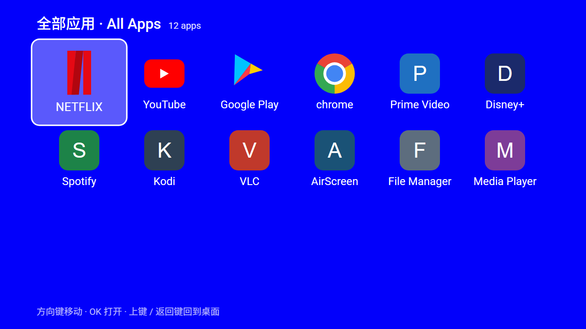

# DP Launcher

投影仪 / Android TV 桌面的 **1:1 复刻**实现。原生 Android（Kotlin + XML 布局 + RecyclerView），
不依赖任何第三方 UI 框架，可直接编译安装到设备上作为 HOME 桌面使用。

> 复刻目标：截图中这台投影仪的桌面（蓝色壁纸 + 4 个应用大卡 + 倒影 + 底部五个功能键）。
> 截图来自需求方，见 [`_ref/reference.png`](_ref/reference.png)；所有尺寸/取色都由
> [`tools/`](tools) 里的脚本从这张图里量出来，而不是"看着差不多"。



---

## 1. 需求对照表

需求方在截图上写了 4 条要求，逐条落地情况：

| # | 要求 | 实现 | 位置 |
|---|------|------|------|
| 1 | **倒影** | `ReflectionContainer`：把卡片栅格化成 bitmap，用镜像 canvas 变换 + 竖直 alpha 渐变量绘到卡片下方，和参考图一样是"渐隐的镜面" | [`ReflectionContainer.kt`](app/src/main/java/com/dp/launcher/ui/widget/ReflectionContainer.kt) |
| 2 | **任意焦点都能跳进"全部已安装 APPLIST"** | 4 条入口：底部栏按 ↓、卡片行按 ↑、任意位置按 **MENU**、长按 OK；另外 "My Apps" 键也直接进。退出用返回键或从第一行按 ↑，焦点精确还原到进来之前的位置 | [`HomeFragment.kt`](app/src/main/java/com/dp/launcher/ui/home/HomeFragment.kt) · [`AppDrawerFragment.kt`](app/src/main/java/com/dp/launcher/ui/drawer/AppDrawerFragment.kt) |
| 3 | **做完看 demo 质量，发一个演示视频** | 同尺寸 HTML 1:1 预览 + 自动录制脚本，产出 [`demo/launcher-demo.gif`](demo/launcher-demo.gif) / `.webp`；并给出与参考图的像素级相似度报告 | [`tools/capture_video.mjs`](tools/capture_video.mjs) · [`tools/compare.py`](tools/compare.py) |
| 4 | **传 GitHub 源码 DEMO 看代码质量** | 单模块工程、无业务耦合、KDoc 覆盖、vendor 能力用资源数组解耦、几何量单一数据源并自动导出到预览 | 本文件第 4、5 节 |

---

## 2. 演示

| 首页（1:1 复刻） | 全部应用列表 |
|---|---|
|  |  |

动图（12 fps，含焦点移动 → 跳转应用列表 → 打开应用全过程）：


> `demo/launcher-demo.gif`（720×405，2.7 MB）与 `demo/launcher-demo.webp`（960×540，0.6 MB）都是
> `tools/` 里的脚本自动生成的，不是手工剪辑。

---

## 3. 编译与安装

环境要求：JDK 17、Android SDK（compileSdk 35 / build-tools 36.0.0）。

```bash
# 编译 debug 包
./gradlew :app:assembleDebug
# 产物：app/build/outputs/apk/debug/app-debug.apk（约 4.0 MB），
# 同时会同步一份到 dist/DP-Launcher-v1.0.0.apk 方便传输

# 单元测试（Robolectric 真布局冒烟 + 几何自检，共 8 项）
./gradlew :app:testDebugUnitTest

# 安装到投影仪/盒子（USB 调试打开后）
adb install -r dist/DP-Launcher-v1.0.0.apk
adb shell am start -n com.dp.launcher/.LauncherActivity
```

装到**手机**上发现问题（传文件被改名、装不上、点开闪退）看
[`docs/install.md`](docs/install.md)，里面按现象给了排查表。

想让系统开机默认进这个桌面，装好后在 `设置 → 应用 → 默认应用 → 主屏幕应用` 里选 **DP Launcher**
（Manifest 同时声明了 `HOME` 和 `LAUNCHER`：既能被设为桌面，也能像普通 App 一样点开）。

主要技术参数：`minSdk 23 (Android 6.0)` / `targetSdk 34` / Kotlin 2.0.21 / AGP 8.7.3 / Gradle 8.13。

---

## 4. 工程结构

```
app/src/main/java/com/dp/launcher/
├─ LauncherActivity.kt          唯一 Activity：声明 HOME intent、全屏常亮、托管两个页面
├─ LauncherApp.kt               Application：常驻应用列表仓库（桌面会被系统反复拉起）
├─ ui/
│  ├─ DesignSpec.kt             ★ 全部几何/颜色常量（参考图像素），单一数据源
│  ├─ UiScale.kt                参考像素 → 设备像素，min(w/1280, h/720) 等比缩放
│  ├─ LauncherNavigator.kt      首页 ↔ 抽屉 ↔ Activity 的导航契约（避免互相持有）
│  ├─ home/                     HomeFragment / AppCardAdapter / DockAdapter / DockItem
│  ├─ drawer/                   AppDrawerFragment / AllAppsAdapter
│  └─ widget/                   AppCardView / DockItemView / ReflectionContainer / AppGridItemView（全部自绘）
├─ data/
│  ├─ AppRepository.kt          PackageManager 查询 + 安装/卸载广播 → StateFlow 快照
│  ├─ AppColorResolver.kt       卡片底色：参考图品牌色 → Palette 取主色 → 包名哈希兜底
│  └─ model/AppEntry.kt         一次启动所需的全部数据（含 launchIntent）
└─ system/
   ├─ StatusClock.kt            状态栏时钟（ACTION_TIME_TICK）
   ├─ NetworkStatusMonitor.kt   Wi-Fi 连接状态 + 信号等级（NetworkCallback）
   ├─ InputDeviceMonitor.kt     鼠标/空鼠是否接入（InputManager）
   └─ SystemActionRouter.kt     五个功能键 → 厂商 Activity（资源数组驱动 + 兜底）
```

设计取舍（面试/评审可能追问的点）：

- **几何量只有一处**：`DesignSpec.kt`。Android 端经 `UiScale` 折算成设备像素；HTML 预览的 CSS
  变量由 `tools/export_tokens.py` 从同一个文件生成。两边不可能对不上，改一个数值两边同时生效。
- **分辨率无关**：所有位置用"参考图像素 × `min(w/1280, h/720)`"，在 720p 投影仪上是 1:1，在
  1080p/4K 上等比放大，不会像纯 dp 方案那样在 1080p 电视（960×540 dp 画布）上溢出。
- **卡片底色不是硬编码**：`AppColorResolver` 先查参考图里量到的品牌色表（保证复刻一致），
  查不到就对图标跑 `Palette` 取主色并做 HSL 归一化，仍有兜底哈希色 —— 换任何一台设备都不会出现
  白底白字。
- **应用列表常驻**：桌面一天要被拉起几十次，`AppRepository` 挂在 Application 上，只有安装/卸载/
  更新广播才重新查询；查询全部在 `Dispatchers.IO`，发布快照回主线程。
- **不申请 `QUERY_ALL_PACKAGES`**：用 `<queries>` 声明 MAIN/LAUNCHER intent 即可列出全部可启动应用，
  上架/合规更干净。
- **厂商能力解耦**：Keystone / Miracast / Signal Source 没有 AOSP 标准 intent，
  [`arrays.xml`](app/src/main/res/values/arrays.xml) 里每个按键一组候选（`action:` / `component:` /
  `|` 分隔备选），换厂商只改 XML 不改 Kotlin；全部失配时退到系统显示设置并 Toast 提示，不会"点了没反应"。

---

## 5. 1:1 是怎么保证的

参考图是一张低分辨率、被重复压缩过的截图（边缘模糊约 10 px），所以没有靠肉眼对，
而是"量 → 拟合 → 复验"三步：

1. **量**：`tools/probe.py` / `measure*.py` 扫描参考图，取色、找边缘、量文字包围盒、量倒影衰减曲线。
2. **拟合**：`tools/calibrate.py` 用无头 Chrome 按候选参数渲染 HTML 预览，选与参考图差异最小的组合。
   例如卡片宽/间距、底部键聚焦放大倍数、边框颜色都是这样扫出来的（见 [`docs/design-spec.md`](docs/design-spec.md)）。
3. **复验**：`tools/compare.py` 输出整屏与分区误差，`tools/geometry_report.py` 用同一套检测代码
   在两图上分别量边缘坐标并打印差值。

当前复验结果（1280×720，与参考图逐像素对齐后）：

| 区域 | 平均绝对误差 (MAE, 0–255) | 容差内像素占比 |
|------|--------------------------|--------------|
| 整屏 | 12.4 | 78.0 % |
| 产品界面（排除需求方红色批注区域，y ≥ 146） | **9.3** | **83.5 %** |
| 卡片行 | 12.3 | 78.8 % |
| 底部功能栏 | 13.7 | 74.6 % |
| 背景色 | 0.4 | 98.8 % |

（"整屏"含需求方批注浮层区域，该区域无法复刻，因此以"产品界面"一行为准。）

剩余差异主要来自三处**不可复刻**的部分，已在文档中标注：
参考图顶部的红色批注浮层、参考图里各应用的**品牌字标**（Netflix/YouTube/Google Play 用的是各自
的定制字体，同一套系统字体无法同时匹配四种字宽）、以及参考图自身的压缩噪声。
预览里 4 个品牌图标是按参考图量到的尺寸重绘的 SVG，正式 App 里图标一律取自
`PackageManager`（真实安装的应用图标）。

---

## 6. 跑一遍验证脚本

```bash
python tools/export_tokens.py     # 从 DesignSpec.kt 生成预览用 CSS 变量
python tools/compare.py           # 渲染 HTML 预览并与参考图比对，产出 preview/out/*
python tools/geometry_report.py   # 两图边缘坐标逐项对照
./gradlew :app:testDebugUnitTest  # 几何自检测试
npm install && node tools/capture_video.mjs   # 录制演示帧
python tools/make_video.py        # 合成 demo/launcher-demo.gif|webp
```

依赖：Python 3（Pillow + numpy）、Node 18+（仅用于录制，puppeteer-core 复用本机 Chrome）、
Chrome/Edge。

---

## 7. 素材与授权

- 代码：MIT（见 [`LICENSE`](LICENSE)）。
- `preview/assets/*.svg`：Netflix / YouTube / Google Play / Chrome 标识是**按参考图重绘的示意图**，
  仅用于本 demo 的视觉对照，商标归各自公司所有，请勿商用。
- `_ref/reference.png`：需求方提供的参考截图，用于像素比对。
- Roboto 字体（`preview/assets/fonts`）：Apache-2.0，来自 Google Fonts。
